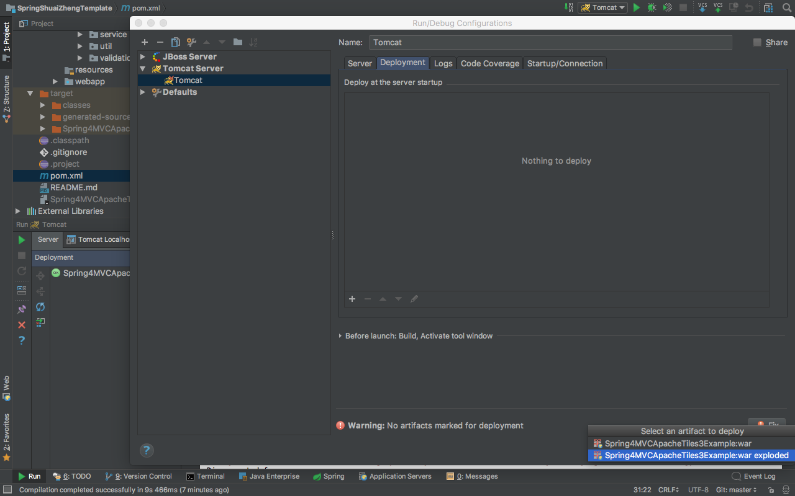
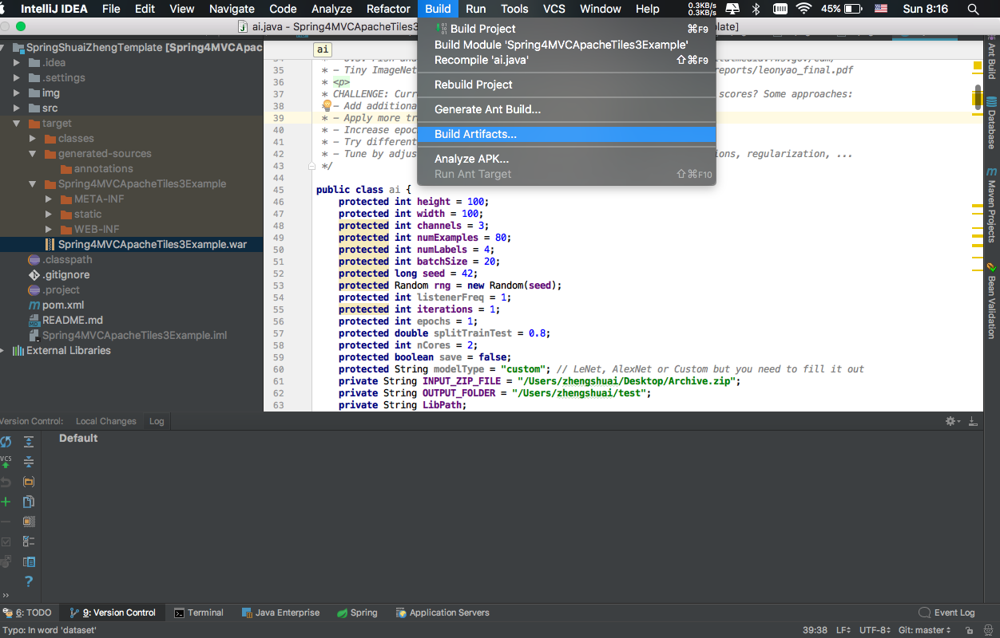
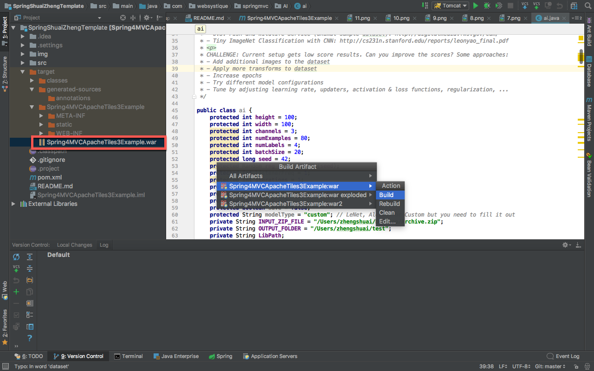
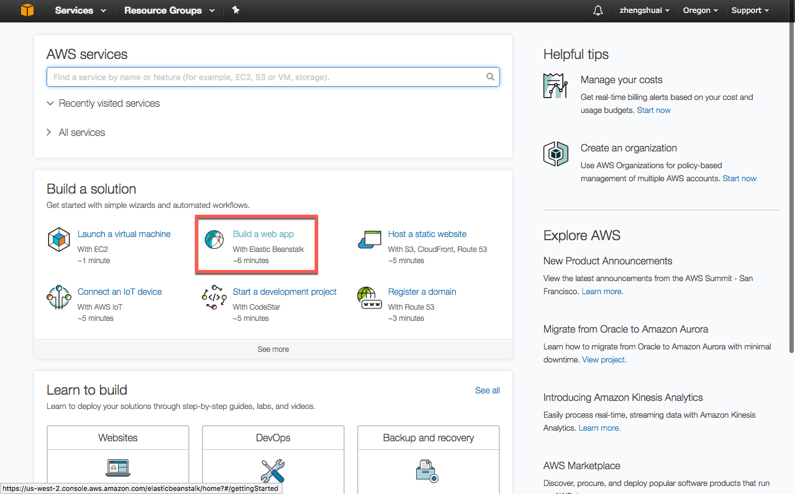
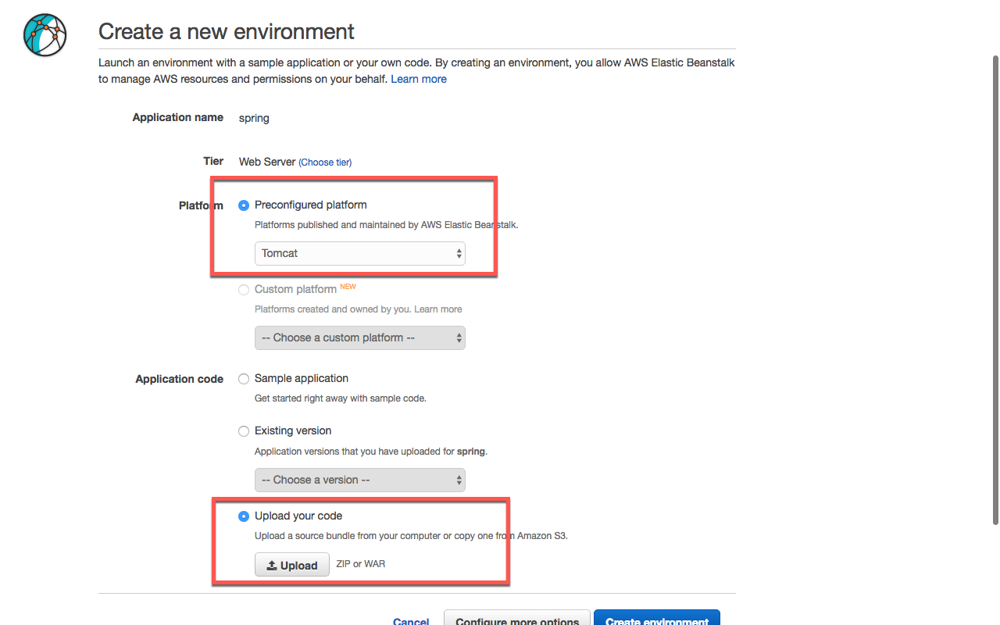
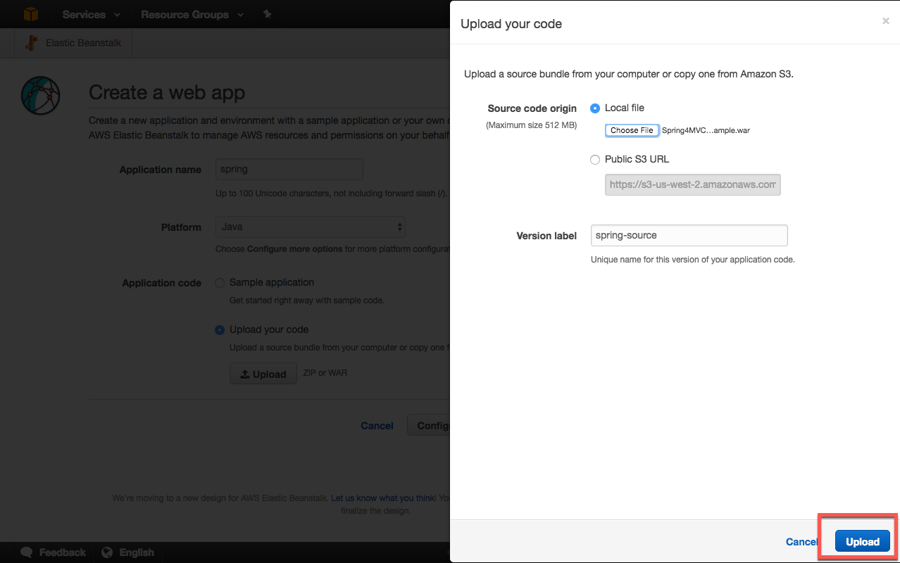
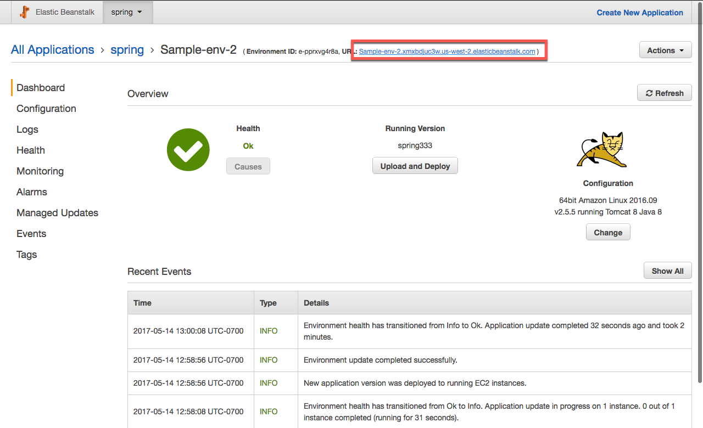

# SeniorProject
Made by Shuai Zheng Advisor: Prof. Homayoun Yousefi'zadeh

Prerequement:

To simulate the website, below are required:

1. Java JDK 1.7
    Can be downloaded from webite: 
    http://www.oracle.com/technetwork/java/javase/downloads/java-archive-downloads-javase7-521261.html
    
   
2. IntelliJ [Ultimate] Edition, which is cross platform IDEA and could be used in Windows, Mac, Linux system
    Can be acquired using student account and download at:
    https://www.jetbrains.com/idea/

3. Apache Tomcat 8
    Can be downloaded from website:
    http://tomcat.apache.org/download-80.cgi
  
Usage:

With above preparation done, simulate the website with following steps:

1.  Open IntelliJ IDEA, Click "Import Project".
    

2.  Choose the Project folder you've saved to, click "OK".
    below is the example location that I used.
    

3.  Choose Maven, click "next"
    

4.  Check the box in front of "Import Maven projects automatically"
    
    

5.  Click "next"

    

6.  Click the "+" bottom, choose "JDK"

7.  Choose the jdk 1.7 file folder you saved to.
        below is the example location of my jdk 1.7.0_80
        

8.  Click "OK"

9.  Click "finish"

    

10. On the top right corner, click the second icon, press "Edit Configurations"
    

11. Click the "+" bottom, choose Tomcat Server - Local.
    Note that if you are using Community version of IntelliJ, you won't have this option.
    So make sure you are using the Ultimate version.
    

    To Run MachineLearning, add VM Option in IntelliJ.

12.  click configure, click +, and select the path that Tomcat download :
    

13.  Copy and paste VM Option, click "OK"
click the fix button to select war exploded:
    

    now you should be able to run Machine Learning algorithm.

14. click ok.
    

15. click button to run

    

# Deploy to the third party
16. Build Artifacts
    

17. click Build and generate .war file
    

18. go to https://console.aws.amazon.com and then create a free account (account creation process may be changed since it uses 2-step verification).

19. sign in to Amazon AWS from https://console.aws.amazon.com and find "ElasticBeans Talk" under "Deployment & Management".
    

20. After that you may see an empty page, just click "Create a new Application" from right corner side of the page. Enter your information and then just simply click your new created environment.
    
    

21. After that you can upload and deploy ".war" files to this free account.
    
    
22. access web pages in a browser after running the content in a third party serve. My Demo  Sample-env-2.xmxbdjuc3w.us-west-2.elasticbeanstalk.com 
    

# References:
    
1. deeplearning4j:https://deeplearning4j.org/
2. Spring 4 MVC+Apache Tiles 3 Example: http://websystique.com/springmvc/spring-4-mvc-apache-tiles-3-annotation-based-example/

