# SeniorProject
Made by Shuai Zheng Advisor: Prof. Homayoun Yousefi'zadeh

Prerequement:

To simulate the website, below are required:

1. Java JDK 1.8
    Can be downloaded from webite: 
    http://www.oracle.com/technetwork/java/javase/downloads/jdk8-downloads-2133151.html
   
2. IntelliJ [Ultimate] Edition, which is cross platform IDEA and could be used in Windows, Mac, Linux system
    Can be acquired using student account and download at:
    https://www.jetbrains.com/idea/

3. Apache Tomcat 8
    Can be downloaded from website:
    http://tomcat.apache.org/download-80.cgi
  
Usage:

With above preparation done, simulate the website with following steps:

1.  Open IntelliJ IDEA, Click "Import Project".
    

2.  Choose the Project folder you've saved to, click "OK".
    below is the example location that I used.
    

3.  Choose Maven, click "next"
    

4.  Check the box in front of "Import Maven projects automatically"
    
    

5.  Click "next"

    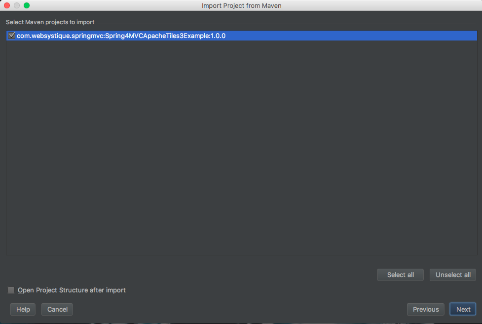

6.  Click the "+" bottom, choose "JDK"

7.  Choose the jdk 1.8 file folder you saved to.
    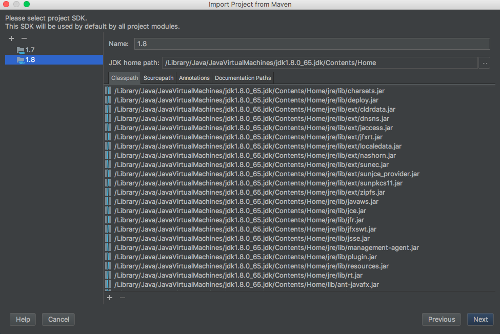

8.  Click "OK"

9.  Click "finish"

    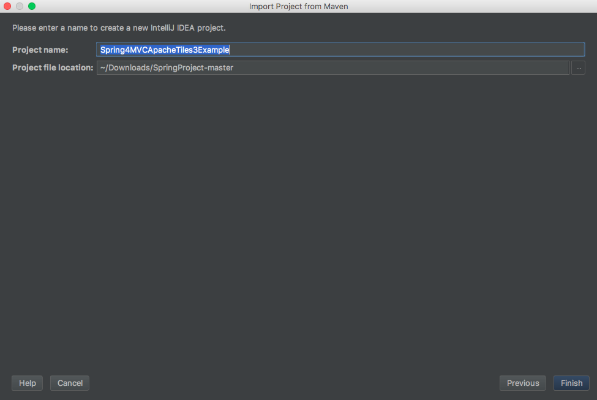

10. On the top right corner, click the second icon, press "Edit Configurations"
    

11. Click the "+" bottom, choose Tomcat Server - Local.
    Note that if you are using Community version of IntelliJ, you won't have this option.
    So make sure you are using the Ultimate version.
    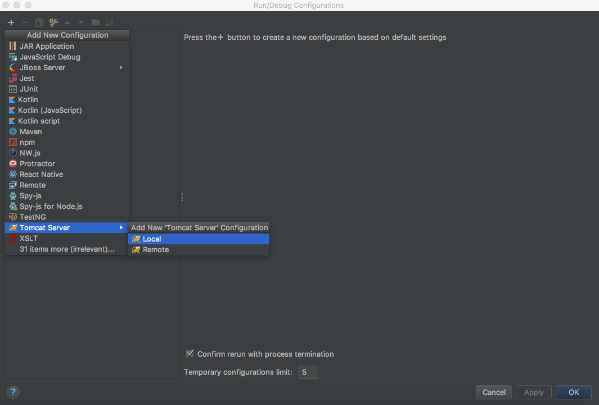

    To Run MachineLearning, add VM Option in IntelliJ.

12.  click configure, click +, and select the path that Tomcat download :
    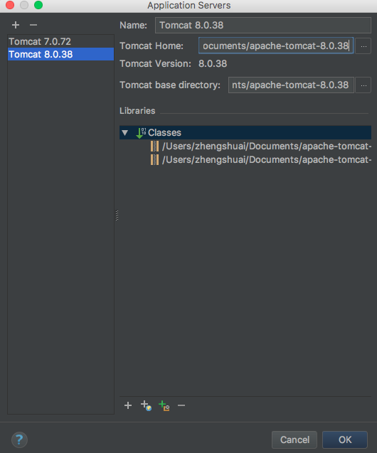

13.  Copy and paste VM Option, click "OK"
click the fix button to select war exploded:
    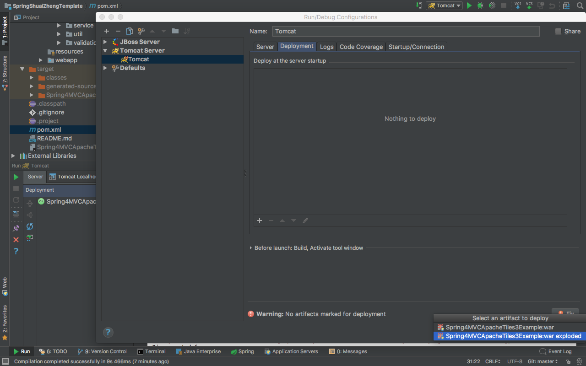

    now you should be able to run Machine Learning algorithm.

14. click ok.
    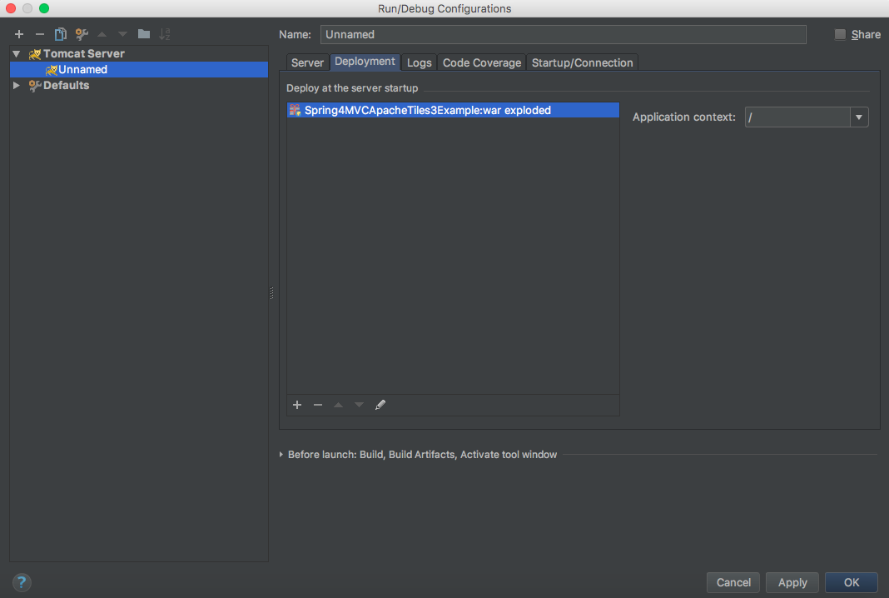

15. click button to run

    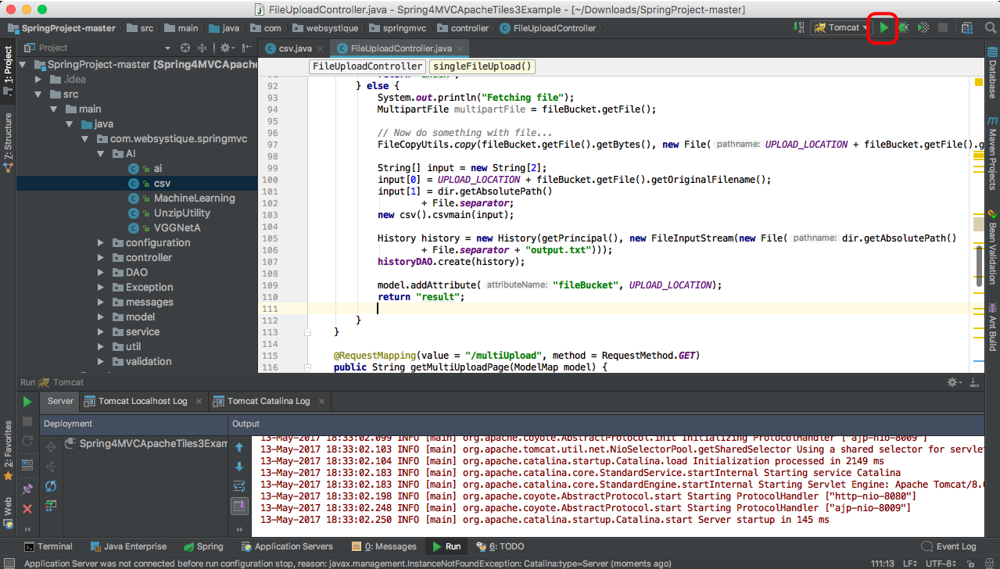

16. Demo
    

17. menu in the location src/main/webapp/WEB-INF/views/tiles/template/defaultHeader.jsp from line 29-59
    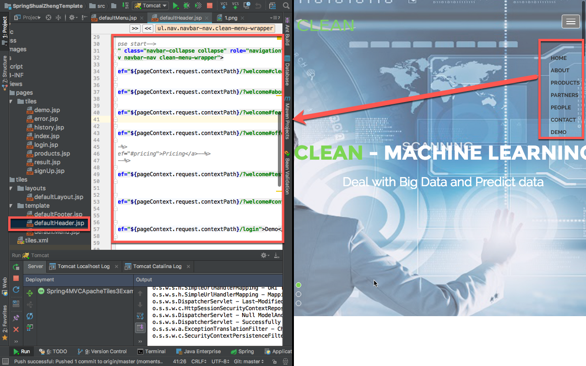
18. image in the location src/main/webapp/static/images/slider from image 1-3
    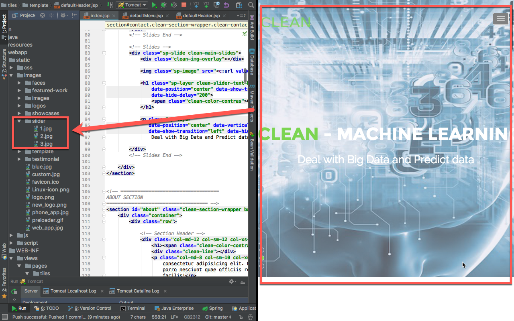
    
19. logo in the location src/main/webapp/static/images/logo.png
    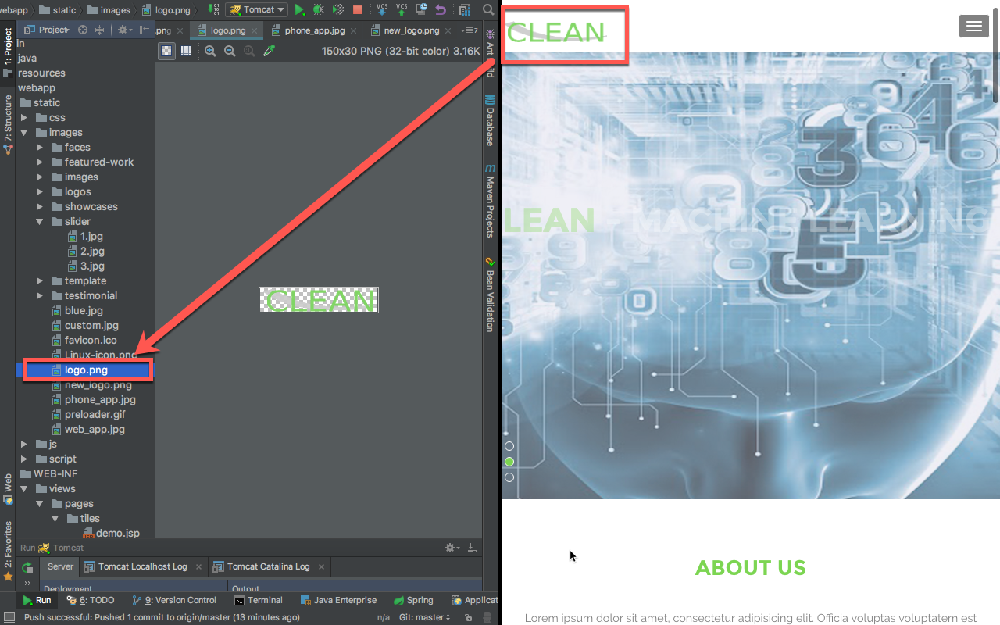
20. about us in the src/main/webapp/WEB-INF/views/pages/tiles/index.jsp from line 106-168
   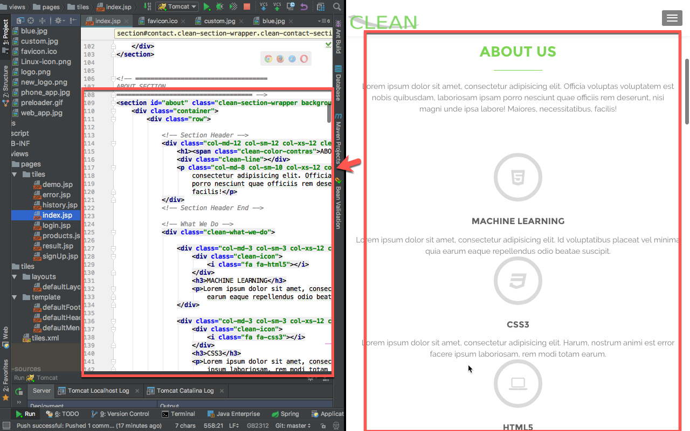
   
21. product in the src/main/webapp/WEB-INF/views/pages/tiles/index.jsp from line 196-315 and images in the location src/main/webapp/static/images/featured-work
   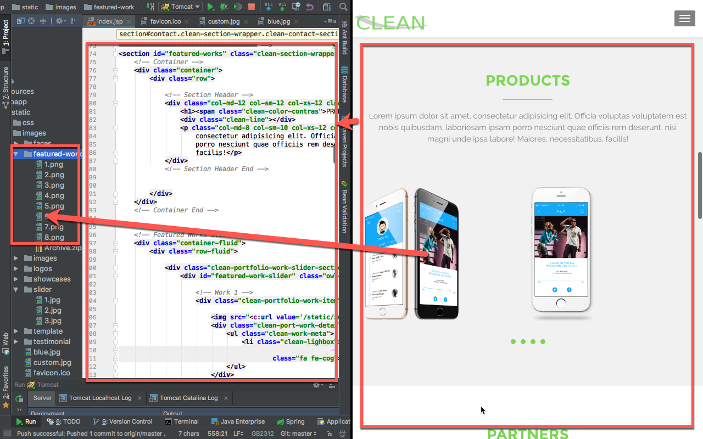
   
22. partners in the src/main/webapp/WEB-INF/views/pages/tiles/index.jsp from line 318-349 and images in the location src/main/webapp/static/images/logos
   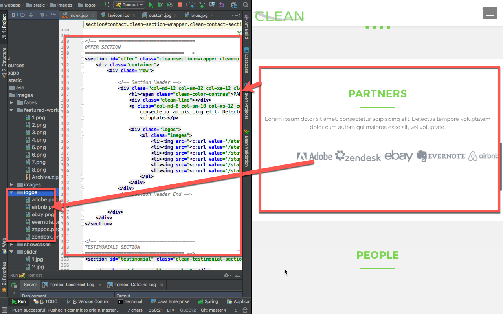
   
23. people in the src/main/webapp/WEB-INF/views/pages/tiles/index.jsp from line 352-437 and images in the location src/main/webapp/static/images/images
   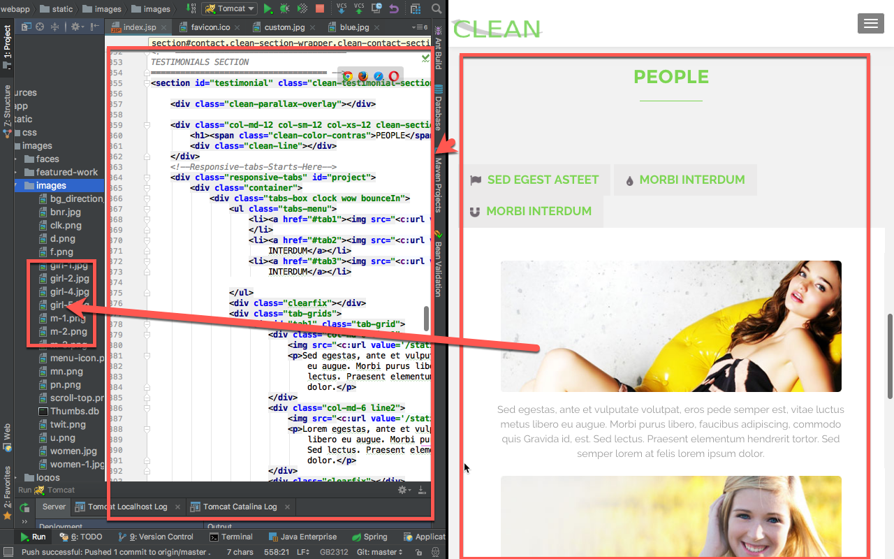
   
24. contact us in the src/main/webapp/WEB-INF/views/pages/tiles/index.jsp from line 555-603

   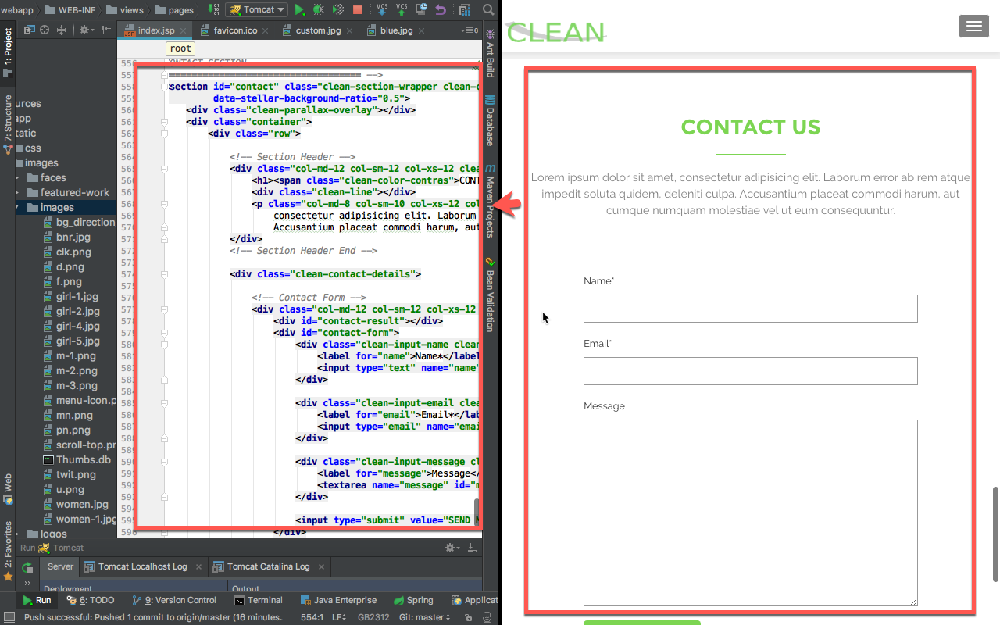
   
25. Footer in the src/main/webapp/WEB-INF/views/tiles/template/defaultFooter.jsp from line 1-67
   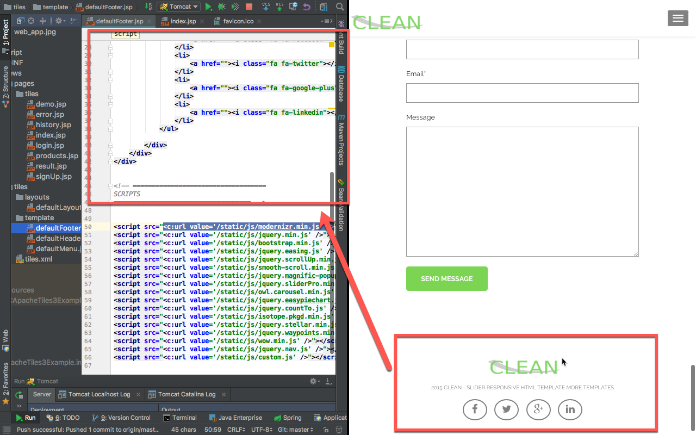
  
   # References:
    
   deeplearning4j:https://deeplearning4j.org/

